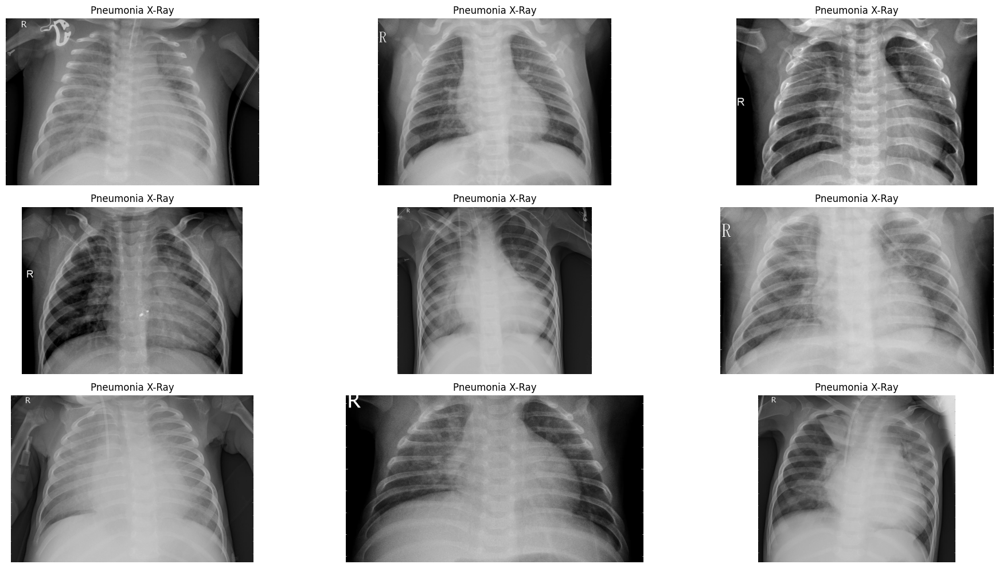
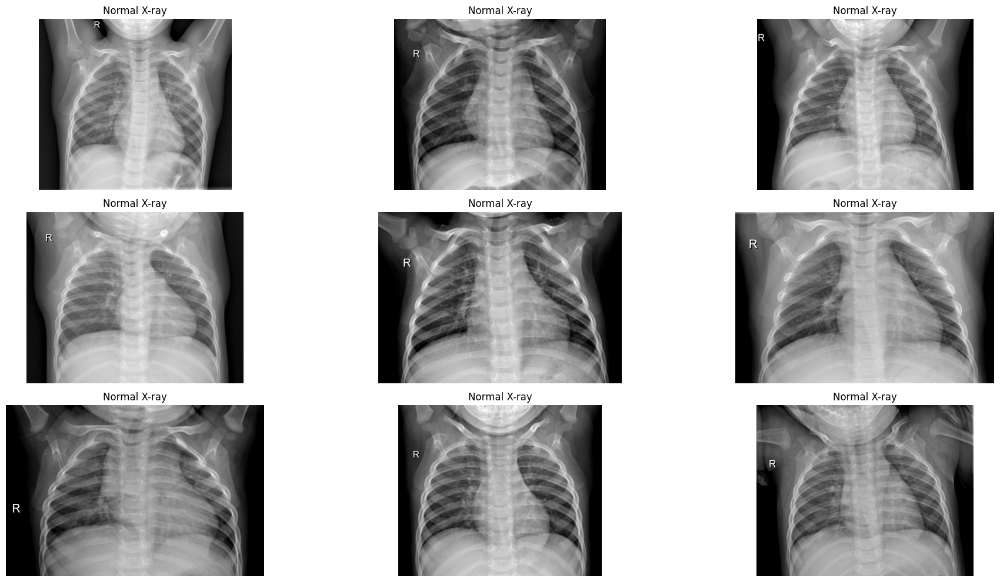
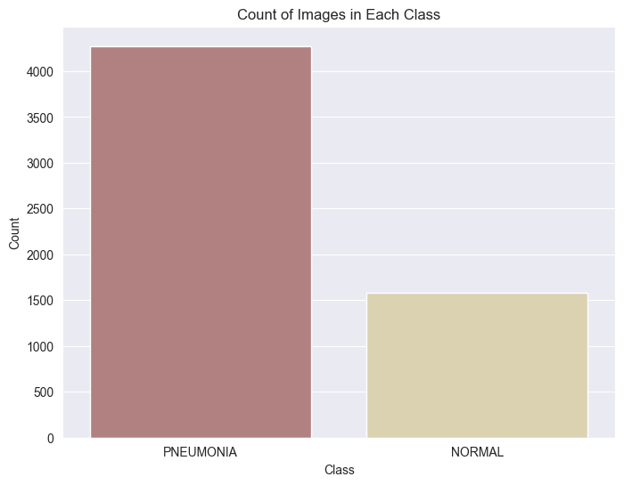
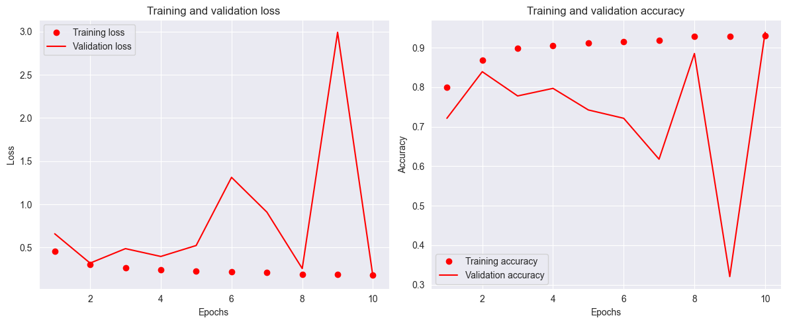
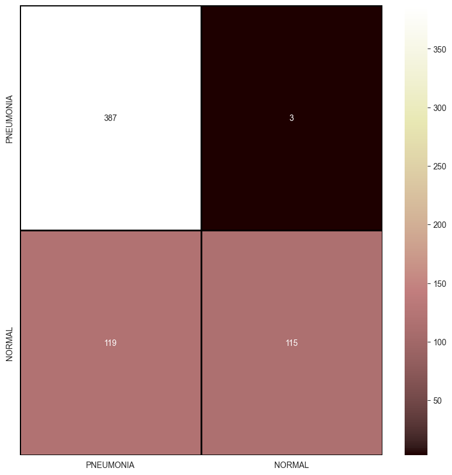

#  Chest X-Ray Images Model and Predictions
 ## Data Overview
 This dataset contains thousands of validated OCT and Chest X-Ray images  described and analyzed in "Identifying Medical Diagnoses and Treatable Diseases by Image-Based Deep Learning". The images are split into a training set and a testing set of independent patients. Images are labeled as (disease)-(randomized patient ID)-(image number by this patient) and split into 4 directories: CNV, DME, DRUSEN, and NORMAL.

## Business understanding
* The model can be used to aid early detection and diagnosis of chest related medical conditions.
* The model can assist radiologists and healthcare professionals in interpreting X-ray images accurately. It can serve as a second opinion tool, reducing the risk of diagnostic errors.
* By automating the initial screening process, the model can help healthcare facilities manage high volumes of X-ray images more efficiently. It can prioritize cases that need urgent attention.
* It can help hospitals allocate intensive care units (ICU) and isolation wards to patients with confirmed or suspected respiratory conditions.
* In telemedicine applications or in regions with limited access to radiologists, the model can provide preliminary assessments, allowing for faster decision-making and treatment planning.
* The model's predictions can be valuable in clinical trials and research studies related to respiratory diseases. It can be used to screen participants and monitor their progress.
* Aggregated data from the model's predictions can be used to generate insights into trends and patterns related to chest-related conditions. This information can be valuable for epidemiological studies and public health planning.
* By automating parts of the diagnostic process, the model can potentially lead to cost savings for healthcare providers. It can help streamline workflows and reduce the need for extensive manual review.
* Ensuring compliance with regulatory standards and certifications is crucial in the healthcare industry. The model should be designed and implemented in a way that aligns with industry-specific regulations and privacy laws.
* Regular updates and retraining of the model based on new data and research findings are essential for maintaining its accuracy and effectiveness over time.

## Data Understanding
The dataset has been split into two main parts: a training set and a testing set. These sets consist of images from different patients, and they are used to train and evaluate deep learning algorithms for medical diagnosis.

Each image is labeled with information indicating the type of disease, a randomized patient ID, and a unique image number for that patient. This labeling system helps in organizing and identifying specific images within the dataset.

Pneumonia is an infection that inflames the air sacs in one or both lungs. The air sacs may fill with fluid or pus, causing cough with phlegm or pus, fever, chills, and difficulty breathing.Chest X-ray, may help confirm the diagnosis.

## Dataset preparation
The dataset is organized into three folders, the train,test and validation which contain subfolders for each image category the Pneumonia and Normal.
The X-ray image category is  Pneumonia and Normal.

## Dataset of two data points from data set.

## Count of each image in the dataset

## Evaluating Model
20/20 [==============================] - 3s 156ms/step - loss: 0.4963 - accuracy: 0.8045
Test Accuracy: 0.8044871687889099
20/20 [==============================] - 3s 170ms/step - loss: 0.4963 - accuracy: 0.8045
Test Loss: 0.4962526559829712

## Visualizing Accuracy and Loss

## Predictions

The confusion matrix shows that the model is doing a good job of classifying pneumonia. The accuracy is high, and the sensitivity and specificity are also good.

## Recommendations

* The model can be used to aid early detection and diagnosis of chest related medical conditions. It can assist radiologists and healthcare professionals in interpreting X-ray images accurately. It can serve as a second opinion tool, reducing the risk of diagnostic errors.
* By automating the initial screening process, the model can help healthcare facilities manage high volumes of X-ray images more efficiently. It can prioritize cases that need urgent attention.
* It can help hospitals allocate intensive care units (ICU) and isolation wards to patients with confirmed or suspected respiratory conditions.
* In telemedicine applications or in regions with limited access to radiologists, the model can provide preliminary assessments, allowing for faster decision-making and treatment planning.
* The model's predictions can be valuable in clinical trials and research studies related to respiratory diseases. It can be used to screen participants and monitor their progress.
* Aggregated data from the model's predictions can be used to generate insights into trends and patterns related to chest-related conditions. This information can be valuable for epidemiological studies and public health planning.

## Conclusion

* The model has the potential to be a valuable tool for early detection and diagnosis of chest related medical conditions. However, it is important to note that the model is not perfect and should not be used as a substitute for a clinical diagnosis by a qualified healthcare professional.
* The model should be used in conjunction with other diagnostic tools and should not be relied upon solely to make decisions about patient care. It is also important to ensure that the model is used in a way that is compliant with all relevant regulations and privacy laws:

Overall, the model has the potential to be a valuable tool for improving the early detection and diagnosis of chest related medical conditions. However, it is important to use the model in a responsible and ethical way.

## slides link
https://www.canva.com/design/DAFui7NYBcI/ew38vlNmL5vjkZqPMdJpfQ/edit?utm_content=DAFui7NYBcI&utm_campaign=designshare&utm_medium=link2&utm_source=sharebutton